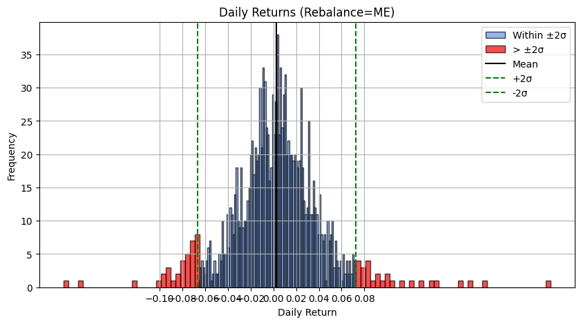

# Strategy: Earnings IV Churn
The Earnings IV Churn strategy exploits potential mispricings in the options market around earnings announcements. Prior to these events, implied volatility (IV) on the underlying stock often spikes due to demand from market participants hedging their risk. These traders are frequently price-insensitive, driving IV above levels justified by realized post-earnings moves.

## Hypothesis
The Earnings IV Churn strategy exploits potential mispricings in the options market before key announcements—such as earnings—by identifying and trading elevated implied volatility (IV). In the lead-up to these events, near-term IV tends to rise sharply due to hedging demand from institutional players, often outpacing changes in longer-dated IV.

This strategy posits that short-term IV becomes excessively elevated relative to long-term IV, creating a term structure imbalance that can be exploited through calendar spreads or IV reversion trades. Once the earnings event passes, short-term IV tends to drop faster than long-term IV, allowing the trader to profit from this volatility mean reversion across the term structure.

_Example_: 
"When implied volatilty (IV) is significantly higher than the realized volatility, options may be overpriced. This strategy aims to short volalitiy by selling options when IV > RV by a certain threshold.

## Strategy Logic
I used long calendar call spreads, shorting a near-term option (1–5 days to expiration) while buying a far-term option (30+ days to expiration). Trade triggers were based on distortions in the IV term structure, especially when steep backwardation appeared ahead of earnings.

### Position Type
* Long calendar spread: Near-term short call + long-dated long call
* Maturity gap: ~30 days
* Directional bias: Neutral

### Entry Conditions
* Earnings announcement after close of trading session
* Backwardation slope of IV term structure (Near term vs Long term maturity)
* Historic Volatity vs Implied Volatility

_Example_:
Example:
* The graph below shows NVDA’s IV term structure pre-earnings (05/28).
* Near-term IV: ~120% vs historical RV: ~40.26%
* Market priced in a ±8% move in the underlying stock.

However, I must emphasize that this position wasn't risk free as NVDA have had large single day moves as shown in the diagram below.

### Exit Conditions
This week, I exited trades 15 minutes after the market opened post-earnings.
Rationale: Minimize exposure to post-earnings announcement drift (PEAD), which can offset IV gains if delta risk is unhedged.

## Observations
* Strategy showed high Sharpe ratio (>1.5, even >2 for CRM)
* Debit-based setup: defined max loss
* Highly sensitive to delta/gamma risk, especially if near-term option goes ATM

## Results
I took positions on the following stocks: NVDA, CRM, NTAP, ZS, DELL

Despite promising numbers, my execution was suboptimal:

* Poor pricing on exits
* Closed CRM trade ($22k notional) at market while delta was high → large slippage

Trades this week:
Profitable: NVDA, NTAP, DELL
Losses: CRM (slippage), PATH (slippage), ZS (RV > IV)

## Reflectinon and Future Improvements
From these trades, I have become more comfortable with the variance of my strategy. From my experience, IV churn doesn't happen immediately post earnings event, instead it happens throughout the day. 

Next week I will try to close my positions later into the trading session and close them at small increments over time although I will be susceptible to PEAD risk.

## Related Links
- Strategy Explained : [Link](https://www.youtube.com/watch?v=oW6MHjzxHpU&t=956s)

